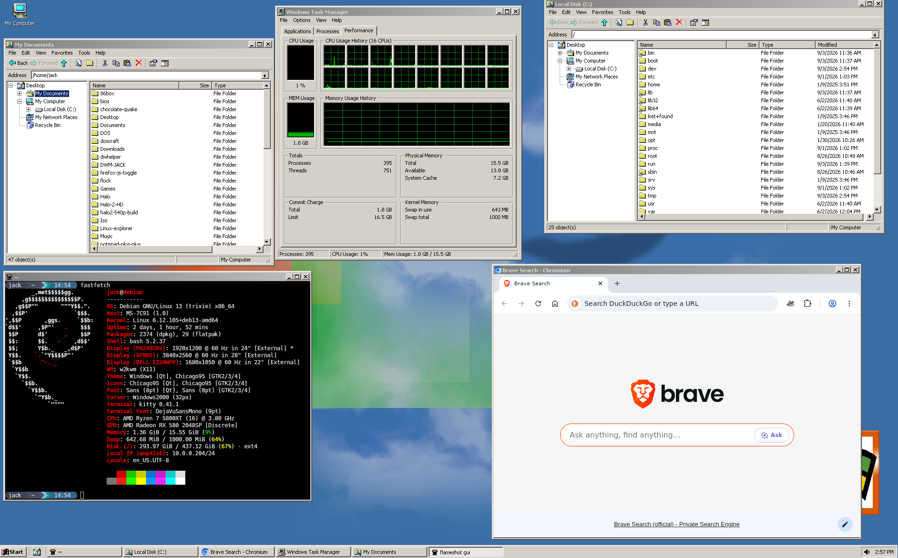
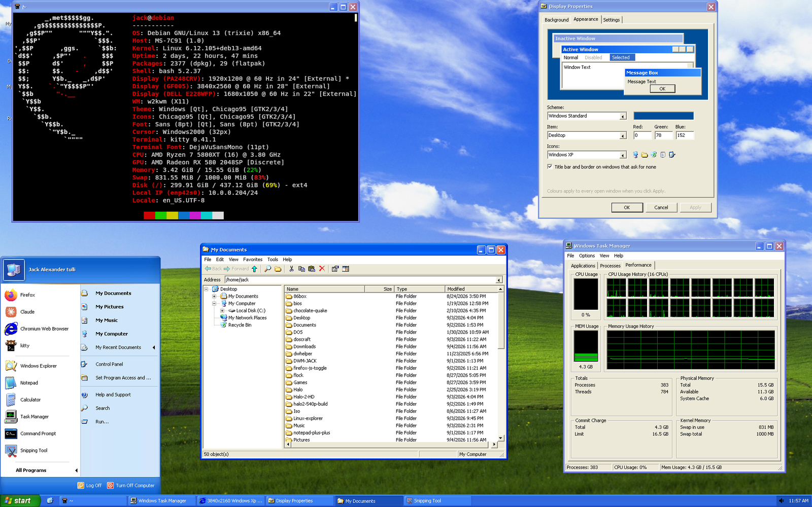
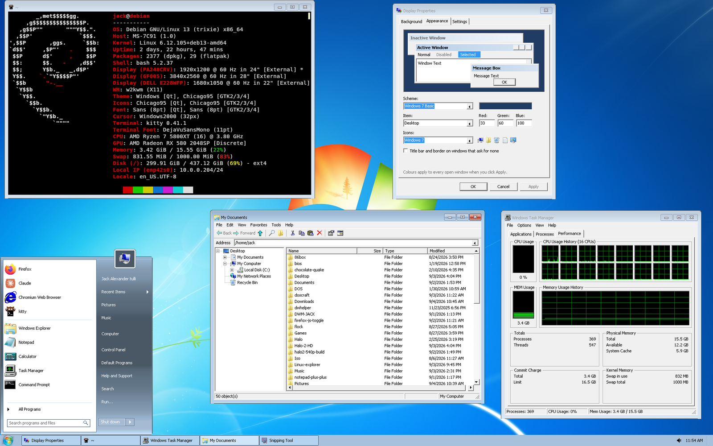

# Linux 2000

A window manager and desktop environment that recreates the Windows 2000
shell on X11: the classic 3D look, the gradient title bars, the taskbar
and Start menu, the logon screen, and the applications that came with it,
written from scratch in C against Xlib. Optional Windows XP and Windows 7
Basic looks are cropped pixel for pixel from the real thing.

Questions, bug reports and screenshots are welcome on the project's
Discord server: https://discord.gg/KPQBnSqcK

## Get it running

**A fresh machine or VM with no desktop** (Debian, Ubuntu, Fedora, Arch,
openSUSE, Alpine or Void), as root:

    curl -sL jacktulli.github.io/w2k | sh

That is the whole install. It fetches this repository into
`/usr/local/src`, installs the X server, sound, VM guest tools and Firefox,
builds and installs the shell, and sets up the first ordinary user (or
`W2K_USER=name`). Reboot and the machine comes up in **Log On to Windows**,
served by `l2kdm`, the shell's own display manager: no LightDM, no GDM. Log
on and you are on the desktop above.

If `curl` is missing on a bare Debian: `apt install curl` first. If the
first run is interrupted, run the same command again; it carries on.

## Updating

Nothing updates on its own. There are three ways to update, and they all
end the same way: the new version is installed over the old one and a
running desktop restarts in place with every window kept.

**From the desktop:** Start > Windows Update (or `l2kupdate`, or the
Windows Update link in Control Panel). It looks the way Windows Update
did. "Check for updates" asks the project's release list what the latest
version is and compares it with yours; "Install" runs the update in a
terminal window in front of you, asking for your password there. The
Product Updates page does the same for the rest of the computer: the
distribution's packages (apt, dnf, pacman, zypper, apk, xbps or emerge,
whichever the machine has), Flatpak applications and Snaps, with a count
of what is waiting and one button to install it all.

**From a shell, as root** -- the same command that installed it:

    curl -sL jacktulli.github.io/w2k | sh

**From a source checkout:**

    git pull
    make
    sudo make install      # then: l2kwm --restart

`l2kwm --version` says what is installed, and Start > Programs >
Accessories > System Tools > About Linux 2000 shows it with the build.

**A machine that already has a desktop:**

    git clone https://github.com/JackTulli/Linux-explorer
    cd Linux-explorer
    ./install.sh --xinitrc    # packages, build, install, cursors, Chicago95,
                              # Qt, and l2k-session as your startx session

Then `startx /usr/local/bin/l2k-session`, or pick "Windows 2000" in your
display manager. `./install.sh --help` lists the options: `--tahoma`
fetches the shell's typeface, `--user-only` touches only your own
configuration (run it again as another user), `--dry-run` shows what would
happen. `--full` adds the X server and l2kdm and *disables your current
display manager for the next boot*, so the machine then logs on through
Log On to Windows; leave it out to keep GDM, LightDM or SDDM and just pick
the session there.

**By hand:** the build needs a C compiler, make, and the development
packages for X11, Xext, Xrandr, Xcursor, Xft, fontconfig, freetype, zlib
and libjpeg (Debian: `build-essential libx11-dev libxext-dev libxrandr-dev
libxcursor-dev libxft-dev libfontconfig1-dev libfreetype-dev zlib1g-dev
libjpeg-dev`; add `libpam0g-dev` for the display manager). Then

    make
    make install PREFIX=/usr/local

Try it nested first, without logging out of anything:

    Xephyr :2 -screen 1024x768 &
    DISPLAY=:2 ./l2k-session

## What is in the box

    l2kdm          the display manager: Log On to Windows, PAM, the session
    l2k-session    starts the desktop as an X session
    l2kwm          window manager, desktop, taskbar, Start menu, dialogs
    l2kexplorer    Windows Explorer: Folders pane, four views, cut/copy/paste,
                   undo, drag and drop (XDND, with any other program), Recycle
                   Bin, Add to Archive / Extract with progress, Send To,
                   Open With, Properties, Search, drives in My Computer
    l2kcontrol     Control Panel, the Windows 2000 folder with its web-view
                   pane: Date/Time, Default Programs, Device Manager, Display,
                   Folder Options, Fonts, Keyboard, Mouse, Network and Dial-up
                   Connections, Sounds and Multimedia, System, Task Manager,
                   Taskbar and Start Menu
    l2knetwork     Network and Dial-up Connections: one icon per adapter, the
                   Local Area Connection Status dialog (Connection and
                   Activity), and a Wireless Network Connection in the same
                   style with signal strength and a Wireless Networks page
                   (scan, connect, disconnect through NetworkManager)
    l2kdisplay     Display Properties: wallpaper (centre, tile, stretch, fit,
                   fill, span), appearance schemes, themes, monitors
    l2kdevmgmt     Device Manager: the machine's hardware from sysfs, drivers,
                   enable/disable, DKMS driver install (contributed)
    l2knotepad, l2kcalc, l2kcharmap, l2kimage (Imaging), l2ktaskmgr,
    l2ksnip        Snipping Tool
    l2kupdate      Windows Update: checks for and installs a newer Linux 2000
                   on request, and the distribution's own updates (apt, dnf,
                   pacman, zypper, apk, xbps, emerge, Flatpak, Snap)
    linver         About Linux 2000, in the manner of winver: the distribution's
                   logo, the version and build, the distribution, the kernel,
                   who it is licensed to and the memory (Start > Programs >
                   Accessories > System Tools, or Run > linver)

Three looks, from Display Properties > Appearance: the Windows 2000
classic scheme (and its colour variants: Brick, Desert, Eggplant, a
Windows Classic Dark and the rest), Windows XP (Luna, with the two-column Start menu), and Windows 7
Basic (with its Start menu, orb and taskbar). Every element's colour can
be set from the basic-colours palette or by its red, green and blue
values, and title bars have a Color 2 for the far end of their gradient. The XP and 7 chrome is cropped from screenshots and checked by
diffing against them.

Icons come in five sets, from Display Properties > Appearance > Icons:
Windows 2000 (the built-in artwork), Windows 98, Windows XP, Windows 7 and
ReactOS. Every window, the desktop, Explorer and the Start menu follow the
choice at once.

Sounds: Control Panel > Sounds and Multimedia is the Windows 2000 applet,
with the event list (Start Windows, Exit Windows, Asterisk, Critical Stop,
Menu Popup, Minimize, System Notification, Empty Recycle Bin and the
rest), a Name box with a play button and Browse, and a Scheme box that
picks the sound pack: No Sounds, Windows 98, Windows 2000, Windows XP,
Windows 7 and the thirteen Windows 7 themes, shipped under `sounds/`. The desktop plays
them at logon and logoff, on menus, message boxes, balloons, minimizing
and restoring windows, and as Explorer navigates and empties the Recycle
Bin, through paplay, pw-play, aplay, ffplay or mpv, whichever is there.

Notifications from every program appear as the yellow balloon over the
notification area: the desktop provides the `org.freedesktop.Notifications`
service, so Firefox, mail, `notify-send` and anything using libnotify all
show the same balloon, one after another, with a close box and a click to
act on it. `l2knotify "Title" "Text"` sends one from a script without
any of that.

Other programs match: GTK 2/3/4 get the Chicago95 theme and icons, Qt gets
the Windows style through qt5ct/qt6ct, every program gets the Windows
cursors through an Xcursor theme, and Explorer is the folder handler for
`xdg-open` and "show in folder". Display Properties > Programs lets you
pick a different GTK theme, icon theme and Qt style from what is installed
(Chicago95 and Windows are the defaults); the choice is kept in the scheme
and written to the GTK and qt5ct/qt6ct settings with the colours. The colours you pick in Display
Properties > Appearance reach those programs too: on every save, and at
logon, the desktop writes the scheme out as `@define-color` overrides for
Chicago95 (`~/.config/gtk-3.0/w2k-colors.css`, imported from your
`gtk.css`, and the same for GTK 4), a `gtk-color-scheme` line in
`~/.gtkrc-2.0`, and the qt5ct/qt6ct palette. Programs pick the colours up
when they start.

Keys: **Ctrl+Esc** / **Win** Start menu · **Alt+Tab** switch windows ·
**Alt+F4** close · **Alt+Space** system menu · **Ctrl+Alt+Del** Task Manager ·
**Win+E** Explorer · **Win+R** Run · **Win+D** show desktop · typing at the
Start menu searches.

## Configuration

Everything the applets set lives in `~/.w2k/scheme` (colours, theme,
wallpaper, effects, taskbar, folder options, input settings, the monitor
arrangement) and is applied live to every running program. Commands in
`~/.w2k/autostart` (one per line) are launched at logon. Pinned programs,
favorites and the Recycle Bin are under `~/.w2k` too.

The icons are the genuine Windows 2000 artwork (see `icons/README.md`),
baked into the binaries by `tools/genicons.py`; any of them can be replaced
by dropping `<slug>.ico` into `~/.w2k/icons` (`l2kwm --icons` lists the
slugs). The cursor set in `cursors/` is installed to `~/.w2k/cursors` and
turned into the `Windows2000` Xcursor theme by `tools/gencursortheme.py`.

## Layout

    include/w2k.h    drawing primitives, system colours, fonts, icons, menus
    include/w2kui.h  windows, controls (edit, list, tree, scrollbar, ...), dialogs
    lib/             the toolkit ("libw2k"): drawing, controls, XDND, file ops,
                     images (BMP/PNG/JPEG), skins, themes
    wm/              the window manager, taskbar, desktop, Start menus, dialogs
    apps/            the applications and the display manager
    skins/           the XP and Windows 7 chrome, cropped from screenshots
    sounds/          the sound packs, one folder per scheme
    config/          GTK/Qt settings, the l2kdm service and PAM stacks
    tools/           icon and cursor-theme baking, development helpers
    install.sh       the installer; bootstrap.sh the one-command form

## Trademarks and copyright

Linux 2000 is not affiliated with, endorsed by or sponsored by Microsoft
Corporation. Windows, Windows 2000, Windows XP and Windows 7 are trademarks
of Microsoft Corporation, used here only to describe what this desktop
resembles. The code in this repository is the project's own work. The
icons, cursors and the pieces of window chrome cut from Windows screenshots
remain the copyright of their owner; they are included so that the desktop
looks the way it does, and no ownership of them is claimed. If you are the
rights holder and want any of it removed, open an issue.

The programs were called `w2k*` up to version 1.6; since 1.7 they are
`l2k*` (`l2kwm`, `l2kexplorer`, `l2kcontrol`, ...) and the old names are
installed as links to them, so nothing you saved stops working.
